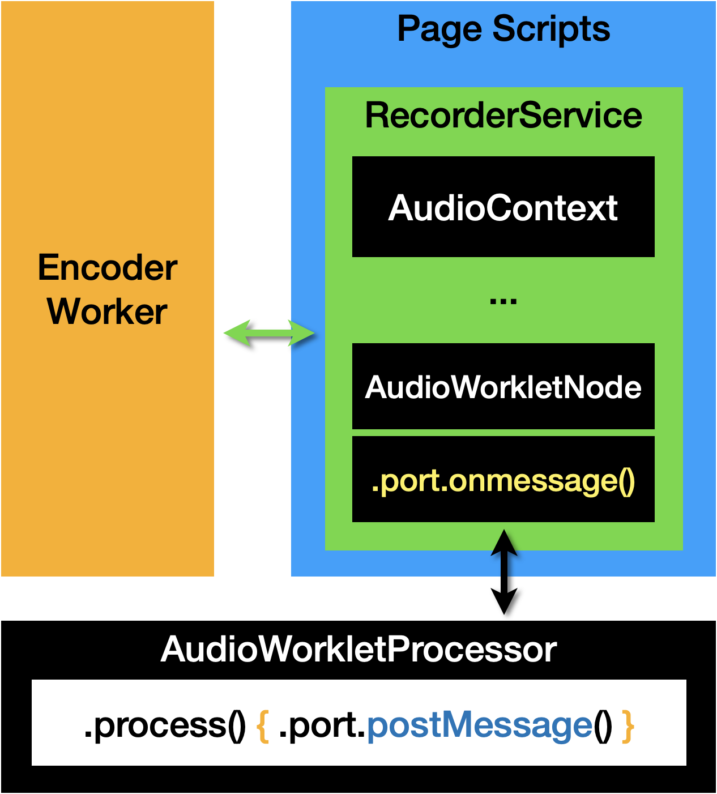
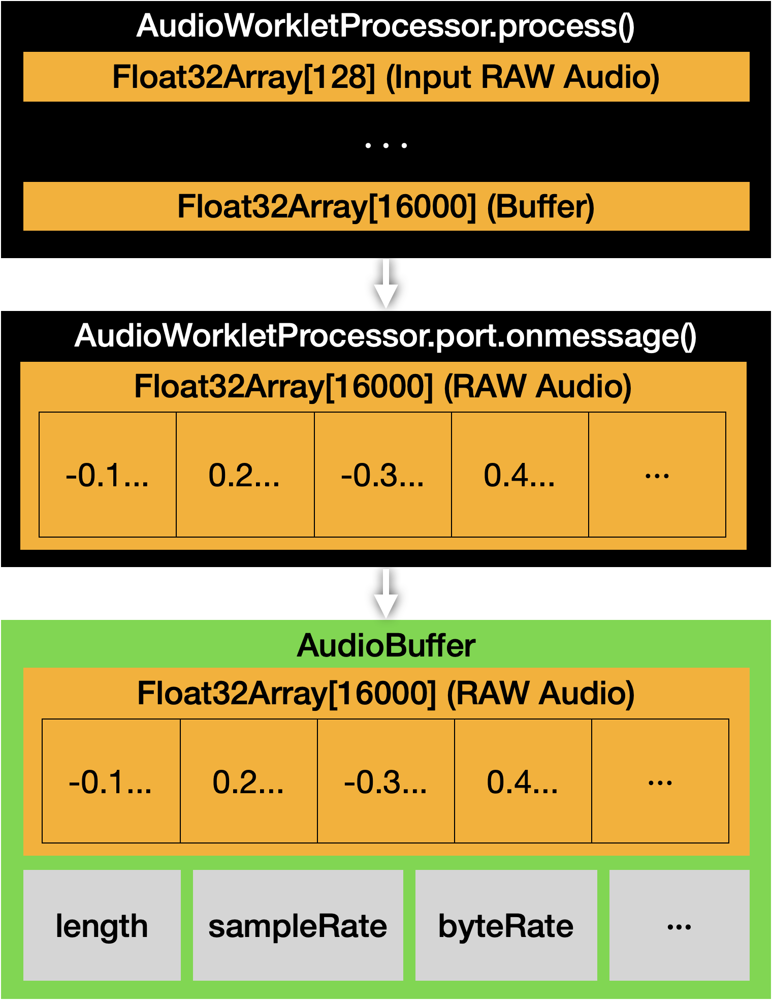

# RecorderService.js

WebAudioAPI Audio Recorder Service

| RecorderService                                 | AudioWorkletProcessor                                      |
| ----------------------------------------------- | ---------------------------------------------------------- |
|  |  |

## Tutorial

```javascript
// Initialize Pre-configured RecorderService
var recorderSrvc = RecorderService.createPreConfigured();

// Add event listener to get audio buffer data
recorderSrvc.em.addEventListener('onaudioprocess', (event) =>
    wavesurfer.loadDecodedBuffer(event.detail.buffer));

// Add event listener for recorded data
recorderSrvc.em.addEventListener('recorded', (event) => {
    console.log("Info: Blob:", event.detail);
    convertBlobToBase64(event.detail.recorded.blob);
    wavesurfer.load(event.detail.recorded.blobUrl);
});

// Start recording
recorderSrvc.record()
    .then(() => {
        // after start recording
    })
    .catch(() => {
        // catch exception
    });

// Stop recording
recorderSrvc.stop();
```

## Documentation

[Docs.md](docs.md)
